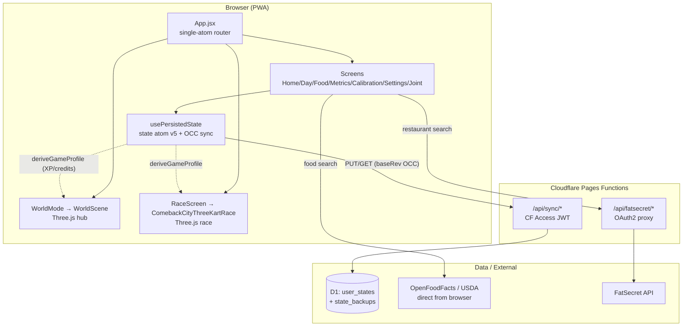
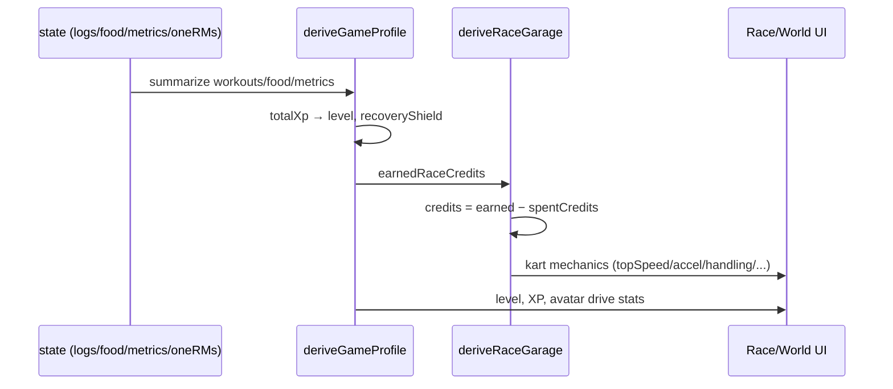

# Codebase Map — Comeback Tracker

> Auto-generated by Cartographer. Last mapped: 2026-06-15.
> Scope: the `comeback-tracker` PWA — `src/`, `functions/`, `migrations/`, build config.
> Excluded: `AnimatedShowcaseDesigns/` (an unrelated standalone showcase site that shares this repo), `docs/`, `tmp/`, `scripts/` (37 Node QA scripts), and `3d generations:character sheets/` (untracked raw Tripo GLBs).

A personal fitness/recovery PWA (React + Vite, Cloudflare Pages + D1) bundling a Three.js arcade kart-racing minigame whose XP/level/credits derive from the user's real fitness data. The kart game (`src/game/`, 74 files, ~344k tokens) is now the dominant body of code.

---

## System Overview



**Stack**: React 18, Vite 5, Tailwind 3 (Kintsugi palette), Three.js, Recharts, lucide-react, vite-plugin-pwa, @zxing/browser, pixi.js (legacy race only). Backend = Cloudflare Pages Functions + D1.

---

## Directory Structure

```
src/
  App.jsx                 Single-atom router (one useState; #race hash deep-link)
  main.jsx                React + PWA service-worker bootstrap
  hooks/
    usePersistedState.js  THE state atom — localStorage + cloud sync, OCC, schema v5
    useRestTimer.js       In-session rest timer (not persisted)
  screens/                Top-level screens (Home/Day/Food/Metrics/Calibration/Settings/Joint)
  components/             Shared UI (FoodEntrySheet, BarcodeScanner, RestTimer, primitives, TemplateSaveModal)
  lib/                    Program data, nutrition math, food APIs, utils (pure, no React)
  game/                   Three.js world hub + arcade race + economy/profile derivation
    race/                 The modular race engine (tracks, physics, render, runtime, telemetry, playtest)
functions/api/
  sync/                   CF Access-gated state sync to D1 (OCC)
  fatsecret/              OAuth2 client-credentials proxy (no auth gate)
migrations/0001_*.sql     D1 schema (user_states, state_backups)
```

---

## Module Guide

### 1. App shell & persistence (the non-game spine)

**`src/App.jsx`** — Custom router: a single `useState(initialScreenFromHash)`, no react-router. `#race` is the only hash deep-link (cleared on nav-away via `history.replaceState`; a `hashchange` listener keeps state synced). `day-N` matched by regex outside the `switch`. All screens lazy-loaded via a `lazyNamed()` helper. `homeMode` (`state.game.homeMode`) toggles `<WorldMode>` (Three.js hub wrapping everything) vs. a `basic` header/nav shell. Read-only view-mode (viewing another profile) forces `basic` and locks nav to home/day-N. `VITE_RACE_DISABLED` hides the Race nav + redirects `#race` to an error screen. `VISUAL_REFERENCE_ROUTES` gate exposes `visual-*` debug routes in dev. Export uses `Blob`+`createObjectURL` (→ CSP `blob:` requirement); import runs `normalizeState` (schema migration) before `setState`.

**`src/hooks/usePersistedState.js`** — The single most load-bearing file. One state atom; `SCHEMA_VERSION = 5`. Shape: `{ schemaVersion, settings, oneRMs, currentWeek, logs, metrics, epleyRows, food, game }`. Sync meta stored separately (`comeback-tracker-sync-meta-v1`): `{ userId, cloudRev, lastCloudUpdatedAt, lastPulledAt, lastPushedAt, dirtySince }`.
- **Sync/OCC flow**: `GET /api/sync/me` → `GET /api/sync/state?userId=own`. Compares stored `cloudRev` to server `cloud.rev` to pick: `needs-decision` (upload prompt / choose-source), `conflict` (dirty + rev mismatch), or clean pull. Any `setState` → debounced local save (200ms) + debounced cloud push (1500ms) via `PUT /api/sync/state {state, baseRev, force}`. Server 409 on `baseRev` mismatch → `markConflict`. Background `PROFILE_POLL_MS = 30000` re-fetches `/me`. `online` event triggers immediate push if dirty.
- **Schema migrations**: v1→v2 add `food`; v2→v3 unit-aware food (`serving`|`gram`); v3→v4 `food.templates`; v4→v5 `game.hub` (city hub state/cosmetics/metrics).
- **Gotchas**: `applyingCloudState` ref guards a pull from re-triggering a push; `preBootstrapDirty` ref catches `setState` before `startSync` finishes; `viewOnly` mode writes only to `syncState.viewedState`, never to real state/cloud.

**`src/lib/`** (pure, no React): `program.js` (PROGRAM rotation, LIFTS, `VITE_USER_PRESET=andrew|alexander` defaults — falls back to Alexander), `nutrition.js` (Mifflin-St Jeor, **hard-coded male formula**, 1000 kcal floor), `foodHelpers.js` (local-tz `YYYY-MM-DD` date keys — not UTC), `foodApi.js` (OFF + optional USDA, **direct from browser**), `restaurantApi.js` (FatSecret via same-origin proxy), `foodParse.js` (AI-macro text parser), `portionChips.js`, `utils.js` (`epley1RM`, `phaseForWeek`, `calcTargetWeight`, `typeColors`).

**Screens** (`src/screens/`): Home (World/Basic dashboard + `LowPolyCityCanvas`), Day (`w{week}d{day}` log keys, joint traffic-lights, rest chips), Food (date nav, macro targets, templates, compliance chart), Metrics (Recharts BW/protein charts, Home Base Recap), Calibration (Epley calculator over `state.epleyRows`), Settings (City Garage cosmetics + race upgrade shop + body metrics + 1RM + reset), Joint (static reference, no state).

### 2. Game economy & profile derivation (the bridge: fitness → game)

These pure modules turn real fitness state into game numbers. **No Three.js.**

- **`src/game/gameProfile.js`** — `deriveGameProfile(state)` is canonical. XP = `loggedSets·35 + completedExercises·90 + completedCourses·150 + foodDays·120 + metricWeeks·160 + filledRMs·40`; `level = floor(totalXp/500)+1`; `recoveryShield = max(0, 100 - jointWarnings·8)`. Exports `GAME_AVATARS` (6 avatars w/ per-kart drive stats), `isWorkoutDayComplete`, `nextSuggestedDay`.
- **`src/game/raceProgression.js`** — `earnedRaceCredits = loggedSets·12 + completedExercises·28 + completedCourses·95 + sessions·45 + streak·30 + filledRMs·18`. Credits available = `earnedCredits − garage.spentCredits` (**only `spentCredits` is ever stored**; credits are always re-derived). Exports `RACE_UPGRADES` (engine/tires/turbo), `RACE_ITEMS` (12 shop items), `deriveRaceGarage`, `normalizeRaceGarage`, `upgradeCost`.
- **`src/game/gameMissions.js`** — `buildGameMissions` (course/fuel/calibration/recovery/metrics/race-reward, priority-sorted), `getActiveMission`.
- **`src/game/raceAvailability.js`** — `VITE_RACE_DISABLED` kill-switch + `filterRaceDestinations`.

> ⚠️ **Known divergence**: `HomeScreen.jsx` has a private inline `buildGameProfile` missing the `completedCourses·150` term — it disagrees with the canonical `deriveGameProfile` used by Metrics/Settings.

### 3. World hub (`src/game/WorldScene.jsx` + visuals)

The explorable Three.js overworld shown on Home when `homeMode === 'world'`.

| File | Purpose |
|---|---|
| `WorldMode.jsx` | Orchestrator: chooses WorldScene vs. screen content, session analytics, onboarding, missions, reward pulses. Renders WorldScene **only** on the home screen. |
| `WorldScene.jsx` (**4,455 lines — god-file**) | Self-contained: imperative scene build, kart physics, road-network constraint, collision, portals, rAF render loop — all in one `useEffect`. Procedural geometry (no GLB). Has its OWN inline kart builder + district buildings (does **not** reuse `city3dAssets.js`). FPS-adaptive pixel ratio. `FallbackWorld` (2D CSS) for no-WebGL. |
| `comebackCityVisuals.jsx` (1,055 lines) | Mixed: runtime `VISUAL_PALETTE` + `CAMERA_PRESETS` (used by WorldScene) AND marketing/reference components + a self-contained 2D mini-game. Split candidate. |
| `comebackCityVisuals.css` (2,324 lines) | World-hub + reference CSS. |
| `city3dAssets.js` | Shared procedural Three.js factories (`createKartModelV2`, `createDistrictModel3D`, `createObjectiveBeacon3D`). Used by the **race** renderer + `ComebackCityScene3D`, NOT by WorldScene. |
| `worldConfig.js` | 7 hub destinations + `WORLD_BOUNDS`. |
| `courseV2.js` | Data-only Comeback City track geometry (`COMEBACK_CITY_COURSE_V2`, `TRACK_SCALE=1.35`, `KartTuningV2`). |
| `HudOverlay.jsx` | World-mode HUD (mission panel, minimap, destinations). |

> ⚠️ **Palette fragmentation**: the neon-dusk color set is duplicated in ≥4 places — `VISUAL_PALETTE` (comebackCityVisuals), `CITY3D_PALETTE` (city3dAssets), inline `palette` per `worldConfig` destination, and `districtAnchors` in courseV2. Values mostly but not perfectly consistent.

### 4. Race entry layer (`src/game/`)

Three race components coexist:

| Component | Tech | Role |
|---|---|---|
| **`ComebackCityThreeKartRace.jsx`** (**3,617 lines — god-file**) | Three.js | **Current/primary** race. Exports `KART_CHARACTERS` (5: crrt-bunny, tclow, seth-penguin, mizzle, layer23), `KART_OPTIONS` (3 karts: hero/icesled/kenney), `DEFAULT_CHARACTER_KEY`. Inlines most simulation; imports only ~5 `race/` modules (tracks, driftFeel, rivalRacers, heldItems, airTricks). |
| `ArcadeRace3D.jsx` (678 lines) | Three.js | More **modular** runtime — composes ~18 `race/` modules. Used by `RacePlaytestHarness` for QA. Represents the "target architecture" the god-file has not adopted. |
| `ComebackCityKartRace.jsx` (871 lines) | Pixi.js | **Legacy/fallback** 2D pseudo-3D scroller. Imports nothing from `race/`. |

`RaceScreen.jsx` (the cup-select hub) and `RacePlaytestHarness.jsx` (standalone QA entry) sit above these.

**Debug URL params** (on `ComebackCityThreeKartRace`): `?track=` `?character=` `?kart=` `?giveItem=<key>` `?itemShowcase=1` `?playableAutoplay=1` (`?raceAutoplay=1` for ArcadeRace3D path) `?kenneyKart=1`. Invaluable for QA/captures.

> ⚠️ Two telemetry-publishing race components write the **same** `window.__comebackCityKartTelemetry` global with different shapes — last render wins.

### 5. Select screen & content data

**`RaceScreen.jsx`** (the Track → Racer → Kart cup-select) — flow: `KartIntroScreen` (first-time, localStorage `cc-kart-intro-seen`) → `KartCharacterSelect` (track picker from `KART_TRACKS`, racer grid from `KART_CHARACTERS`, kart grid from `KART_OPTIONS`; picks saved to localStorage) → `confirmCharacter()` mounts `ComebackCityThreeKartRace`. `startRace` bumps `runId` (React key) to remount; `handleFinish` merges results into `state.game.raceResults[trackKey]`.

> ⚠️ **Two track registries coexist**: `KART_TRACKS` (new `TrackDefinition` model, 2 tracks, drives the live 3D race) and `RACE_TRACKS` (legacy 4-track 2D-canvas data, still feeds TrackIntel/results/garage UI). They overlap only on `comeback-city`. `RaceScreen` also contains a large **dead/unreachable** garage+shop UI block after an early `return` (~line 2179).

**Content data modules**:
- `race/tracks/` — **tracks are now DATA, kept Three.js-free so Node QA scripts can import them.** `index.js` (registry `KART_TRACKS = [comebackCity, penguinVillage]`, `DEFAULT_TRACK_KEY`, `trackByKey`), `comebackCity.js` + `penguinVillage.js` (`TrackDefinition` objects: `course`, `laps`, `elevation`, `dressing` flags, `palette`, `ramps`, `shortcut`, `budgets`), `buildCenterline.js` (pure procedural centerline generator + `validateCenterline`). Penguin Village uses `buildCenterline` from 7 waypoints; its `districtAnchors`/`sceneryAnchors` are empty (dressing handled by the runtime's `dressing.penguinVillage` flag).
- `race/heldItems.js` — the **live 3D item set** (deterministic, no RNG): 10 items (aurora, avalanche, blizzard, cocoa, fishbone, iceshield, march, sardine, slapfish, snowball). Position-tiered tables; P4-final-lap ultimates exclusive (`avalanche/aurora/march/sardine`). `itemForPickup(boxIndex, lap, position, finalLap)`.
- `race/rivalRacers.js` — deterministic rival sim, 3 personalities (Blue Speed / Purple Lab / Orange Muscle), rubber-banding, avalanche ultimate.
- `race/driftFeel.js` (MK-style hop→charge→release mini-turbo, 3 tiers) + `race/airTricks.js` (ramp/trick/shortcut-dare arcs).
- `raceItems.js` / `raceHazards.js` — the **legacy** item (19 defs) + hazard (26 types) systems for the 2D/ArcadeRace3D path. Note: some `track`-rarity items reference tracks that don't exist in `RACE_TRACKS` (planned/future).

### 6. The modular race engine (`src/game/race/`)

Used fully by `ArcadeRace3D`; partially by the god-file. Layers:

**Render pipeline** (`race/render/`, setup order): `createRaceScene` (renderer/camera/lights/world Group; **shadows disabled**, render scale 0.58–0.60) → `createTrackMesh` (segments → instanced boxes on `comeback-city`, individual meshes otherwise) → `createRaceScenery` (**1,457-line god-file**: all buildings/districts/skyline/water — `animationHooks` via `world.userData.cityAnimationHooks`) → `createRaceVehicles` (player via `createKartModelV2`, rivals lower-fidelity) → `createRacePickups` (bananas/boxes/gates/hazards). Plus `createKartModel` (`createBasicMaterial` factory, player VFX sub-groups), `raceVfx` (**pure** frame-computation `*FrameFor` + `apply*Frame` mutators), `syncRaceMeshes` (the single per-frame mesh-sync fn), `createBillboardText` (cached sprite text), `raceSceneTheme` (track fog/sky tables + default districts).

**Geometry/physics**: `track/trackGeometry.js` (`compileTrack3D` → `pointAt`/`nearest` — **both O(n) linear scans, called per-frame**; CatmullRom sampling), `physics/kartPhysics.js` (30+ pure force/drift/jump/collision fns operating on mutable state), `physics/kartTuning.js` (`VEHICLES` kart/hover/plane tables, `DRIFT_TUNING`), `camera/chaseCamera.js` (chase profile + collision avoidance — **6+ `new THREE.Vector3` per frame**).

**Per-frame runtime** (`race/race*Runtime.js` + frame modules): `raceFrameClock` (dt clamp 33ms normal / 160ms playtest, FPS lerp), `raceControlsBase` (+ `raceControls` injects playtest), `racePlayerFrame` (the 22-step player physics tick), `raceFrameUpdates`, `raceUpdateRuntime` (composition root binding updatePlayer/Rivals/Hazards/Events/Rankings/Camera), `raceRivals`, `raceVehicleRuntime` (`addBoost`/`setVehicleMode`), `raceHitRuntime`, `raceDropRuntime`, `raceFinishRuntime` (writes `window.__racePlaytestResult`), `raceMotionRuntime` (reduced-motion), `raceCameraRuntime`, `raceAudio` (Web Audio drone/cues — lazy AudioContext, never closes it), `raceHud.jsx` (React overlay; `telemetry` pumped from outside), `raceState` (initial state factory), `raceProgress` (lap detection via `prev>0.82 && new<0.18` threshold, scoring).

**Telemetry**: `raceTelemetry` (measurement + `publishRaceTelemetryFrame`), `raceTelemetryRuntime` (rate-gate, default 250ms), `raceTelemetryDiagnostics` (writes `window.__raceVisualTelemetry` + samples).

**Playtest/autoplay** (`race/playtest/`): gated by `racePlaytestHooksEnabledForEnv` (DEV or `VITE_RACE_PLAYTEST_HOOKS=true`). `?raceAutoplay=1` → `racePlaytestState` enables → `raceAutoplay` (kinematically drives the player along the spline, **bypasses physics**) + `raceVisualScenarios` (per-mechanic capture priming) + `racePlaytestControls` (synthetic controls). `racePlaytestRuntime` aggregates; `racePlaytestNoopRuntime` is the production no-op. Node QA scripts read `window.__racePlaytestResult` / `__raceVisualTelemetrySamples`.

### 7. Backend (`functions/api/`)

**`sync/`** (CF Access-gated): `_shared.js` verifies the `cf-access-jwt-assertion` header (RS256, JWKS cached 5min, checks `iss`/`aud`, maps email via `SYNC_USERS_JSON`). `me.js` (identity + visible profiles), `state.js` (GET any viewable userId; PUT own with OCC: `WHERE user_id=? AND rev=?`, writes a `state_backups` row before every update, 409 on lost race; rejects `schemaVersion !== 5`), `backups.js` + `backups/[id]/restore.js`.

**`fatsecret/`** (**no auth gate** — relies on same-origin + CSP): `_shared.js` (OAuth2 client-credentials token, module-cached), `search.js`, `item.js`.

**`migrations/0001_comeback_sync.sql`**: `user_states` (PK user_id, `rev` INT for OCC) + `state_backups` (UUID PK, indexed by user_id+created_at).

**CSP** (`public/_headers`): `blob:` in `connect-src` (export flow + textures — **the documented washed-out-textures gotcha**), `worker-src 'self' blob:`, OFF + USDA in `connect-src`, no `unsafe-eval` (game must avoid `eval`/`Function`). `globPatterns` in vite PWA config does NOT precache `.glb`/`.json` (fetched at runtime; 4MB Workbox cache cap).

---

## Data Flow

### Fitness data → game numbers


### Cloud sync (OCC)
```mermaid
sequenceDiagram
    participant C as Client (usePersistedState)
    participant F as /api/sync/state
    participant D as D1
    C->>F: PUT {state, baseRev, force}
    F->>D: INSERT backup; UPDATE WHERE user_id=? AND rev=baseRev
    alt changes == 1
        D-->>F: ok
        F-->>C: {rev: baseRev+1}
    else changes == 0 (lost race)
        F->>D: delete safety backup
        F-->>C: 409 sync-conflict
        C->>C: markConflict → resolution UI
    end
```

### Per-frame race tick (orchestrated in the race component's rAF loop)
`advanceRaceFrameClock` → `processRaceCommandFrame` → `resolveRaceControls` (playtest controls override) → `updatePlayer` (or `updateAutoplayPlayer`) → `updateRivals` → `updateTrackHazards` → `updateTrackEvents` → `updateRankings` → `updateCamera` → mesh visual updates → `syncRaceMeshes` → `publishTelemetry` (250ms-gated → `setTelemetry` re-renders HUD) → `renderer.render` → on finish `publishRaceFinishResult`.

---

## Conventions

- **No semicolons**, 2-space soft tabs, full variable names, early returns (see existing code).
- **Tracks/items/hazards as data**: `race/tracks/`, `heldItems.js`, `raceItems.js`, `raceHazards.js` are Three.js-free so Node QA scripts can import them. Keep new track/item content out of render code.
- **Pure vs. effectful render split**: `raceVfx.js` `*FrameFor` functions are pure (return frame data); `apply*Frame` functions do the Three.js mutation. Preserve this boundary.
- **Imperative Three.js in one `useEffect`**: scene lives in a ref, not React state; HUD state is throttled (~7Hz) snapshots. Unstable `onFinish`/`onRestart` callbacks cause full scene rebuilds — pass stable refs.
- **`runId` prop** is the canonical way to restart a race (React key bump), not unmount.
- **Credits/XP never stored** — always re-derived from `state`. Only `spentCredits` persists.
- **Local-timezone date keys** (`YYYY-MM-DD`) everywhere in food/metrics — never UTC.
- **Deterministic game logic**: `heldItems.js`/`rivalRacers.js` use no `Math.random` — reproducible for tests.

---

## Gotchas (high-value, non-obvious)

1. **God-files**: `WorldScene.jsx` (4,455 lines), `ComebackCityThreeKartRace.jsx` (3,617), `createRaceScenery.js` (1,457), `comebackCityVisuals.jsx` (1,055). The modular `race/` engine + `ArcadeRace3D` already demonstrate the target decomposition for the race god-file.
2. **`deriveGameProfile` divergence**: HomeScreen's inline `buildGameProfile` omits `completedCourses·150`. Two XP numbers can disagree on the same screen set.
3. **Two track registries** (`KART_TRACKS` new vs. `RACE_TRACKS` legacy) and **two item systems** (`heldItems.js` live-3D vs. `raceItems.js` legacy). Know which path you're touching.
4. **Dead UI** after an early `return` in `RaceScreen.jsx` (~line 2179) — a full garage/shop/intel layout that never renders.
5. **Shared `window.__comebackCityKartTelemetry`** written by two different race renderers with different shapes.
6. **O(n) per-frame track queries** (`pointAt`/`nearest`) + **per-frame Vector3 allocations** in the chase camera — fine at current scale, the main perf ceiling as tracks grow.
7. **Palette duplicated in ≥4 places** — editing one neon-dusk color requires touching several.
8. **`schemaVersion` is hard-coded to 5** in both client (`SCHEMA_VERSION`) and server (`validateState`). Bumping schema requires coordinated client+server change or pushes 409/400.
9. **FatSecret proxy has no auth check** in code — security depends on CF Access at the route level + same-origin CSP.
10. **CSP `blob:` in `connect-src`** is required (export + textures); removing it washes out race textures on deploy.
11. **Asset pipeline**: never `gltf-transform optimize` the avatar GLBs (corrupts them); GLBs/JSON are not PWA-precached.
12. **`raceAudio` never closes its AudioContext** — repeated race mounts without navigation accumulate contexts (~6 browser cap).

---

## Navigation Guide

- **Add a new track** → author a `TrackDefinition` in `src/game/race/tracks/<name>.js` (use `buildCenterline` for the centerline), register it in `race/tracks/index.js`. Add palette/dressing flags; wire any custom dressing in the runtime's dressing handler. Keep it Three.js-free so QA scripts import it.
- **Add/tune a race item** → `src/game/race/heldItems.js` (live 3D): add to `ITEM_KEYS`, `ITEM_LABELS`, a feel constant, the position-tier tables, and an update/hit handler; the god-file consumes these. (Legacy 2D path = `raceItems.js`.)
- **Tune kart physics/feel** → `src/game/race/physics/kartTuning.js` (`VEHICLES`, `DRIFT_TUNING`) and `driftFeel.js`/`airTricks.js`.
- **Add a character/kart** → `KART_CHARACTERS` / `KART_OPTIONS` in `ComebackCityThreeKartRace.jsx`; add portrait PNGs (`src/assets/`), wire rival personality matching in `rivalRacers.js`.
- **Change XP/credit formulas** → `src/game/gameProfile.js` (XP) and `raceProgression.js` (credits). Also fix HomeScreen's inline copy.
- **Add a screen/route** → add a lazy import + `switch` case in `App.jsx`; nav item in the header/nav shell.
- **Modify cloud sync / schema** → `src/hooks/usePersistedState.js` (client: bump `SCHEMA_VERSION`, add a `migrate` step) AND `functions/api/sync/_shared.js` (server: `validateState` version) together.
- **Modify auth** → `functions/api/sync/_shared.js` (`verifyAccessJwt`, `SYNC_USERS_JSON` allowlist). CF Access config lives in the CF dashboard, not the repo.
- **Add a food data source** → `src/lib/foodApi.js` (+ add origin to CSP `connect-src` in `public/_headers`).
- **Debug/QA a race** → use URL params (`?track=`/`?character=`/`?kart=`/`?giveItem=`/`?playableAutoplay=1`); Node scripts in `scripts/` (`test:kart-proof`, `test:kart-playable`, `test:race`).

---

## Outstanding structural concerns (for the audit)

- Decompose `ComebackCityThreeKartRace.jsx` toward the `race/` module shape `ArcadeRace3D` already uses.
- Reconcile the two track registries and two item systems (or document the boundary as permanent).
- Single-source the neon-dusk palette.
- Remove the dead garage UI in `RaceScreen.jsx`.
- Fix the HomeScreen XP-formula divergence.
- Consider a spatial index for `trackGeometry` queries and pre-allocated camera temporaries before adding larger tracks.
