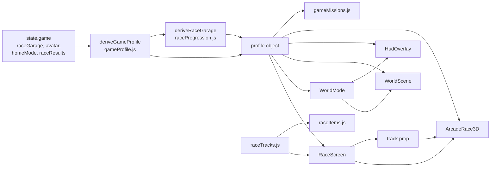
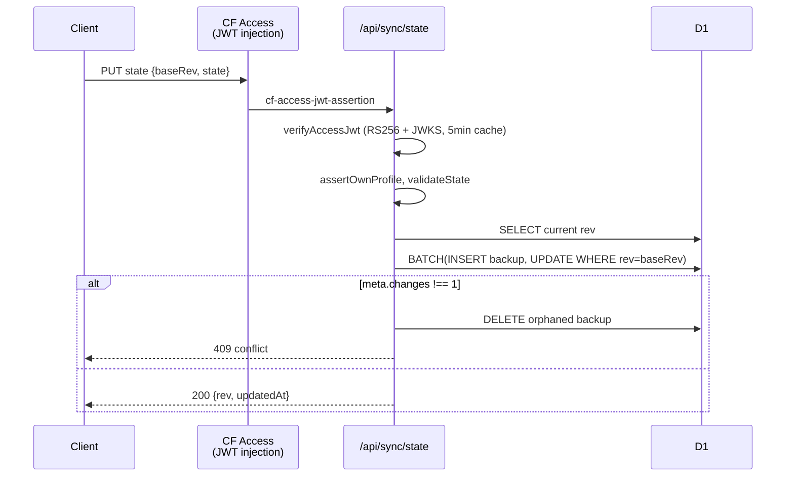
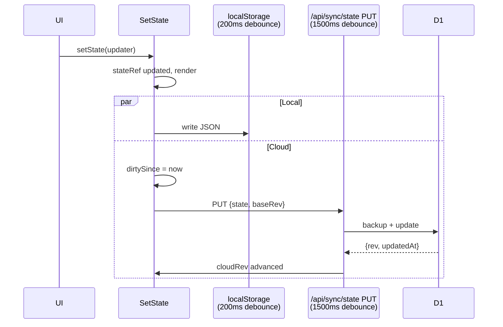

# Codebase Map

> Auto-generated by Cartographer. Last mapped: 2026-05-07.

A personal fitness/recovery PWA built with React + Vite, deployed to Cloudflare Pages with D1 sync behind Cloudflare Access. Includes a Three.js arcade racing minigame whose stats and credits are derived from the user's real workout/food/metrics data.

## System Overview

```mermaid
graph TB
    subgraph Client["React PWA (Vite + Tailwind)"]
        Main[main.jsx<br/>PWA bootstrap]
        App[App.jsx<br/>custom router]
        subgraph Screens
            Home[HomeScreen]
            Day[DayScreen]
            Food[FoodScreen]
            Metrics[MetricsScreen]
            Settings[SettingsScreen]
            Joint[JointScreen]
            Calib[CalibrationScreen]
        end
        subgraph Game["src/game/ — 3D minigame"]
            WorldMode[WorldMode shell]
            WorldScene[WorldScene<br/>Three.js hub]
            HUD[HudOverlay]
            Race[RaceScreen]
            Arcade[ArcadeRace3D<br/>Three.js race]
        end
        subgraph Persist["State"]
            UPS[usePersistedState<br/>local + cloud atom]
        end
    end
    subgraph CF["Cloudflare Pages Functions"]
        FS[/api/fatsecret/<br/>OAuth2 proxy]
        Sync[/api/sync/<br/>state + backups]
    end
    subgraph Data
        LS[(localStorage<br/>comeback-tracker-v1)]
        D1[(D1<br/>user_states + state_backups)]
        OFF[OpenFoodFacts]
        USDA[USDA FDC]
        FatSecret[FatSecret API]
    end

    Main --> App
    App --> Screens
    App --> Game
    App --> UPS
    UPS --> LS
    UPS -.JWT.-> Sync
    Sync --> D1
    Food --> OFF
    Food --> USDA
    Food --> FS
    FS --> FatSecret
    Race --> Arcade
    WorldMode --> WorldScene
    WorldMode --> HUD
```

## Directory Structure

```
comeback-tracker/
├── src/
│   ├── main.jsx                   PWA entry; registerSW (skipped on localhost)
│   ├── App.jsx                    custom router (single useState), nav, sync UI
│   ├── index.css                  Tailwind base + game-layer animation/component CSS
│   ├── screens/                   top-level routed screens
│   ├── components/                shared UI (FoodEntrySheet, BarcodeScanner, RestTimer, primitives)
│   ├── hooks/                     usePersistedState, useRestTimer
│   ├── lib/                       program, nutrition, food helpers, utils
│   ├── game/                      Three.js racing/world subsystem
│   └── assets/game/               game sprites/textures
├── functions/api/
│   ├── fatsecret/                 OAuth2 proxy (search, item)
│   └── sync/                      state, backups, me (CF Access JWT auth)
├── migrations/
│   └── 0001_comeback_sync.sql     D1 schema (user_states, state_backups)
├── public/                        _headers (CSP/cache), _redirects (SPA fallback)
├── scripts/                       cloudflare setup + race playtests + visual checks
├── docs/                          food-upgrade roadmap + this map
├── AnimatedShowcaseDesigns/       SEPARATE landing-page project (not main app — not mapped)
├── package.json, vite.config.js, tailwind.config.js, wrangler.toml
└── README.md, AUDIT.md, CHANGELOG.md, BLOCKERS.md, ITEM_REFERENCE.md, TRACK_DESIGN.md
```

## Module Guide

### `src/App.jsx` — App shell + custom router

**Purpose**: Top-level routing, navigation chrome, sync UI, JSON import/export.
**Routing**: A single `useState` holds a `screen` string (`'home' | 'settings' | 'calibration' | 'metrics' | 'food' | 'joint' | 'race' | 'day-N'`). `renderScreen()` is a switch statement. Hash-only deep linking via `initialScreenFromHash` (only `#race` is honored). No react-router, no `pushState`, no back button.
**State**: Calls `usePersistedState` to obtain `[state, setState, sync]`; calls `useRestTimer` for the rest timer; passes both down to children as props (no Context).
**World/basic fork**: When `state.game.homeMode === 'world'`, renders `<WorldMode>` which provides its own header/nav. Otherwise renders the default header + bottom nav.
**Read-only viewing**: `sync.viewedUserId !== user.userId` activates `readOnly`; `setState` is replaced with `sync.setViewedState` and the nav collapses.
**Gotcha**: `screen.match(/^day-(\d)$/)` only captures one digit — days 10+ would not match.

### `src/screens/` — routed screens

| File | Purpose | Key state | Notes |
|---|---|---|---|
| `HomeScreen.jsx` | Dashboard. Two sub-modes: `WorldHome` (low-poly canvas city + CityNode tiles) and `BasicHome` (weight progress, week/phase stats, day list). | reads `state.game`, `state.logs`, `state.metrics`; writes `state.game.homeMode` and `state.game.avatar` | `LowPolyCityCanvas` is a self-contained Canvas2D RAF loop. Contains a duplicate `buildGameProfile()` that diverges slightly from canonical `deriveGameProfile`. |
| `DayScreen.jsx` | Per-workout-day logging — sets, joint flag, notes, rest timer, GameHud. | reads/writes `state.logs[`w${currentWeek}d${day}`]`, takes `timer` prop | XP per exercise hardcoded (`sets*35 + 90 + bonus*50`), duplicated in `gameProfile.js`. `quest-hit` CSS animation re-fires on every render. |
| `FoodScreen.jsx` | Daily food diary — date navigator, meal buckets, macro bars, templates, 7-day kcal chart. | local: `date`, sheet/template UI; reads/writes `state.food` | Library dedup is by exact name+servingDesc+unit (case-insensitive name). Templates freeze macros at creation time. |
| `MetricsScreen.jsx` | Weekly BW/waist/arm/thigh table, BW chart, 12-wk protein compliance chart. | reads/writes `state.metrics`, reads `state.food.log` | Synthetic 12-row default if `state.metrics` empty — only persisted on first edit. |
| `CalibrationScreen.jsx` | Calibration protocol guide + Epley 1RM calculator (rows in `state.epleyRows`). | reads `LIFTS`, `CALIBRATION_STARTS`, `EFFORT_GUIDE` | `addEpleyRow` only — no row deletion UI. |
| `SettingsScreen.jsx` | Body metrics, all 1RMs (with 70%/78% live previews), danger-zone reset. | reads/writes `state.settings`, `state.oneRMs` | Calls `clearAllData()` directly — wipes localStorage and reloads. No save button; debounced auto-save. |
| `JointScreen.jsx` | Static reference: stop signals, next-day signals, knee/shoulder substitutions, prehab list. | none | Only screen with no props. `SubsTable` silently skips `r[2]` (deprecated field). |

### `src/components/` — shared UI

| File | Purpose | Notes |
|---|---|---|
| `FoodEntrySheet.jsx` | Bottom-sheet with 5 tabs: Library / Search / Scan / Restaurant / Manual. Two-stage browse → edit UX. | Single `AbortController` cancels on tab switch. Restaurant tab hidden unless `VITE_RESTAURANT_API === 'fatsecret'`. Emits per-unit macros (parent multiplies by amount). |
| `BarcodeScanner.jsx` | Full-screen camera; native `BarcodeDetector` with dynamic-import `@zxing/browser` fallback for Safari/iOS. | `doneRef` flag prevents double-detection. Video always in DOM (`opacity-0`). |
| `RestTimer.jsx` | `RestTimerFAB` (fixed overlay) and `RestTimerChips` (preset buttons). | Vermillion color scheme when ≤10s remaining. |
| `TemplateSaveModal.jsx` | Save current meal entries as a named template. | Min 2-char name; live totals via `sumEntries`. |
| `primitives.jsx` | `Card`, `SectionTitle`, `NumInput`, `Pill`. | `NumInput` returns `''` (not 0) on clear for blank-state UX. |

### `src/hooks/` — persistence + timer

| File | Purpose | Notes |
|---|---|---|
| `usePersistedState.js` | **Single state atom**. Combines localStorage persistence (200ms debounce), Cloudflare sync (1500ms debounce), schema migration v1→v4, conflict detection (rev-based OCC), multi-profile viewing, 30s background poll, online-event re-push. Storage key: `comeback-tracker-v1`. Sync meta key: `comeback-tracker-sync-meta-v1`. Schema version: **4**. | Auth is CF Access JWT; 401/403 → `local-only` mode (app works fully offline). `applyingCloudState` ref prevents pull→push echo. `hasMeaningfulData` only checked at bootstrap. |
| `useRestTimer.js` | Session-only countdown with Web Audio beep (880+1320 Hz two-tone) and `navigator.vibrate`. | Lazy AudioContext (needs prior user gesture). Not persisted across reloads. |

### `src/lib/` — business logic

| File | Purpose | Notes |
|---|---|---|
| `program.js` | **Source of truth** for the 7-day workout program, lifts catalog, defaults (settings + food), reference tables (effort guide, joint signals, knee/shoulder subs). | Build-time preset via `VITE_USER_PRESET` (`andrew` cut/186, `alexander` maintain/181). Days 4 & 7 are active recovery (no `pct`). |
| `nutrition.js` | Mifflin-St Jeor BMR + TDEE, phase-aware macro targets (cut/maintain/bulk). | **Hardcoded male formula** (the `+5` constant). Lbs in, internally converted to kg/cm. Calorie floor 1000. |
| `foodApi.js` | OpenFoodFacts (always) + USDA FDC (if `VITE_USDA_API_KEY`). Search + barcode. | OFF `_serving` → `unit:'serving'`; else `_100g` → `unit:'gram'`. USDA Branded → serving; SR Legacy → gram. Dedup by `name|brand` lowercase. |
| `foodHelpers.js` | Date utilities (local-tz `YYYY-MM-DD`), meal buckets, entry aggregation, weekly compliance, `proteinCompliance12w`. | Compliance hit = ±10% kcal AND ≥90% protein. Backward-compat reads `e.amount ?? e.servings`. |
| `foodParse.js` | Parse AI macro lines (JSON-first, regex fallback) → `{name, cal, p, c, f}` or `null`. | `AI_PROMPT` is the clipboard prompt for the "Paste from AI" workflow. |
| `portionChips.js` | Static visual portion estimates (palm/fist/thumb/handful) by category. | All `unit: 'serving'`. |
| `restaurantApi.js` | FatSecret proxy wrapper (`/api/fatsecret/{search,item}`) — search + item details. | Feature-gated by `VITE_RESTAURANT_API === 'fatsecret'`. Surfaces `fatsecret-api-14`/`-21`/`429` errors. |
| `utils.js` | `round5`, `epley1RM` (RIR-adjusted), `phaseForWeek` (CALIBRATION/RE-ENTRY/BUILD/GRIND), `isDeloadWeek` (every 5th), `calcTargetWeight`, `typeColors`, `formatTime`, `computeSessionVolume`. | `calcTargetWeight` returns string `'calibrate'` if no 1RM. |

### `src/game/` — 3D racing minigame

A self-contained Three.js subsystem rendered into the same React tree. Two distinct scenes (open-world hub + arcade race) with shared visuals, separate game loops. Communicates with the fitness app **only through `state.game`** plus a derived `profile` object.



| File | Purpose |
|---|---|
| `WorldScene.jsx` (~3,400 lines, **largest file**) | Three.js free-roam "Comeback City" hub. Full physics (drift charge, boost tiers, gravity, jump), kart variants via `MeshToonMaterial`, particle systems (sparks/boost/skid as instanced meshes), procedural buildings/portals/progress tower, road-network constraint, AABB collision, adaptive DPR (FPS windows ±0.08/-0.14, clamped 0.82-1.72), touch D-pad + swipe drive. Falls back to plain-React `<FallbackWorld>` on WebGL failure. |
| `ArcadeRace3D.jsx` (~3,100 lines) | Three.js GP race. 3 vehicle modes (kart/hover/plane) with distinct physics, item/hazard/rival/switch-pad/flight-gate systems, per-track 3-layer routes (ground/air/hybrid), rubber-band AI with scripted signatures, Web Audio ambient + cues, `?raceAutoplay=1` headless playtest mode (writes to `window.__racePlaytestEvents`/`Result`). **Command pattern** via prop ID change-detection avoids stale closures. Inline ~200-line HUD JSX in the same file. |
| `RaceScreen.jsx` (~2,079 lines) | Full-bleed race shell that owns garage/upgrade/inventory state, derives profile, hosts `<ArcadeRace3D>`, and switches to deprecated `<RaceCanvasFallback>` only when WebGL is unavailable. |
| `WorldMode.jsx` | Top-level shell that wraps the entire app. When `screen === 'home'`, renders 3D world via `<WorldScene>` + `<HudOverlay>`; otherwise renders nav chrome around `renderScreen()` from App.jsx. Hides header+nav when `screen === 'race'` for full-bleed mobile. |
| `HudOverlay.jsx` | React DOM HUD sibling to the WebGL canvas. Mini-map (normalized via `WORLD_BOUNDS`), mission panel, district destination buttons, currency stack, "Enter" prompt. One-way prop comm: `WorldScene → onNearbyChange → parent → HudOverlay.nearbyDestination`. |
| `comebackCityVisuals.jsx` + `.css` | Shared design tokens, `CAMERA_PRESETS` (4 named configs), `DISTRICT_VISUALS` (5 districts), CSS-3D `KartCssModel` (12-span pure CSS kart for design sheet). **`GAME_STATUS` is hardcoded placeholder** — `CurrencyStack` displays fake energy/gem counts. |
| `gameProfile.js` | **Central derivation hub.** `deriveGameProfile(state)` → full `profile` object. XP = `sets*35 + exercises*90 + courses*150 + foodDays*120 + metricWeeks*160 + filledRMs*40`. Level = `floor(xp/500)+1`. `recoveryShield = 100 - jointWarnings*8`. 6 avatars (`GAME_AVATARS`) with distinct `drive{}` physics baselines. |
| `gameMissions.js` | Builds 5 fitness missions (calibration/course/fuel/metrics/recovery) sorted incomplete-first. `getActiveMission` returns the topmost incomplete. Fuel progress = `protein*0.72 + calorie*0.28`. Recovery threshold hardcoded at `>= 90`. |
| `raceTracks.js` | Pure data: 3 tracks (`tide-pier`, `static-storm-plateau`, `magnet-mine-descent`). Each = points spline (1024×768 source space), boost pads, item boxes, banana placements, 3 layers, switch pads, vehicle zones/locks, scripted events, hazard instances, signature item, AI rivals. |
| `raceItems.js` | Item registry: `ITEM_DEFINITIONS` (full behavior), `ITEM_META` (display map merging `RACE_ITEMS` from progression + per-track `signatureItem`), restriction helpers. Hover treated as kart for restrictions. **Dead defs**: `boardwalkGrip`, `warhorn` reference tracks not in current `RACE_TRACKS`. |
| `raceHazards.js` | Hazard type registry — `HAZARD_DEFINITIONS` describes *what each type does*; `raceTracks.hazards[]` describes *where instances are placed*. `HAZARD_EFFECTS` enum is incomplete (some effect strings appear inline only). |
| `raceProgression.js` | Economy: `RACE_UPGRADES` (engine/tires/turbo, 6 levels each), `RACE_ITEMS` (12 buyables), `DEFAULT_RACE_GARAGE`, `normalizeRaceGarage`, `upgradeCost`, `earnedRaceCredits` (fitness→credits), `deriveRaceGarage` (full physics from avatar+upgrades+level). Magic-number baselines reference Nova's drive stats — fragile if avatars change. |
| `worldConfig.js` | `WORLD_BOUNDS` (3D walkable bounds) and `getWorldDestinations(state, profile)` — 7 districts. **Garage destination routes to `'settings'`** (semantically misleading name). |
| `RacePlaytestHarness.jsx` | Standalone Vite entry for `race-playtest.html` (driven by URL params + `window.__raceHarness*` globals). Stub profile bypasses `deriveRaceGarage`. |

### `functions/api/` — Cloudflare Pages Functions



| File | Purpose |
|---|---|
| `fatsecret/_shared.js` | OAuth2 client-credentials token mgmt (module-level cache, 60s expiry buffer), `callFatSecret`, error mapping (`fatsecret-api-{code}`). |
| `fatsecret/search.js` | `GET /api/fatsecret/search?q=` → `foods.search` (page 0, max 20). Short-circuits q<2 chars. |
| `fatsecret/item.js` | `GET /api/fatsecret/item?id=` → `food.get` for serving-level detail. |
| `sync/_shared.js` | Auth + DB helpers: `verifyAccessJwt` (CF Access JWKS, 5min cache), `requireAuth`, `assertCanView`, `assertOwnProfile`, `validateState` (enforces `schemaVersion === 4` server-side), `getStateRow`, `getVisibleProfiles`. User registry from `SYNC_USERS_JSON` env var. |
| `sync/me.js` | `GET /api/sync/me` — auth user + visible profiles (with `hasState` flags). |
| `sync/state.js` | `GET ?userId=` (read, view-permission gated) and `PUT` (own profile only, OCC via `baseRev` integer). Backup + update in D1 batch; orphaned backup cleaned on conflict. `force: true` bypasses `baseRev` for "overwrite cloud" resolution. |
| `sync/backups.js` | `GET ?userId=` — last 50 backup metadata records (no state blob). **No restore endpoint exists.** |

### `migrations/0001_comeback_sync.sql` — D1 schema

- `user_states (user_id PK, display_name, state_json, schema_version, rev INT DEFAULT 1, updated_at, updated_by)` — current live state per user, OCC-versioned.
- `state_backups (id PK, user_id, rev, state_json, schema_version, created_at, created_by)` — append-only audit log; index `(user_id, created_at DESC)`.
- No FK constraints. State stored as a single JSON text column (~1 MB practical D1 row limit).

## Data Flow

### App state → cloud sync



### Food entry end-to-end

1. User opens `FoodEntrySheet` for a meal bucket.
2. **Library**: filter `state.food.library` by `lastUsedAt` (offline). **Search**: OFF + USDA, deduped, 300ms debounce. **Scan**: `BarcodeDetector` → OFF lookup. **Restaurant**: `/api/fatsecret/search` → `/api/fatsecret/item`. **Manual**: type macros, or `parseAiMacros` of pasted AI output, or `PORTION_CHIPS` quick-fill.
3. Selecting a food → `pickFood(food)` → `mode='edit'` with `draft` + `amount`.
4. Confirm → emit per-unit entry `{id, itemId, name, cal, p, c, f, amount, unit, servingDesc, at}` → parent stores in `state.food.log[dateKey][meal]`.
5. Optional `saveToLibrary` writes to `state.food.library`. Cloud push fires 1500ms later.

### Fitness → game profile

`state` (workouts, food, metrics, oneRMs, game) → `deriveGameProfile(state)` computes XP/level/avatar/recoveryShield → calls `deriveRaceGarage(state, profile)` which reads `profile.workout/streak/filledRMs/level` → returns merged `profile` with `profile.race.{credits, mechanics, statBars, garage}`. This is the **only** fitness↔game bridge. If `state` shape changes, race stats silently fall back to defaults — no runtime error.

## Conventions

- **No Context API.** State flows top-down via `state` and `setState` props from App.jsx.
- **Tailwind v3** with custom Kintsugi palette (`ink`, `bone`, `gold`, `vermillion`, `pine`, `charcoal`); `amber`/`red`/`emerald`/`zinc` overridden to warm equivalents so opacity utilities (`bg-red-500/5`) inherit warm tones. Extensive safelist for dynamic color classes.
- **Date keys**: local-tz `YYYY-MM-DD` (`getFullYear/Month/Date`), not UTC.
- **Schema migrations**: numbered functions in `usePersistedState.js`, current version `SCHEMA_VERSION = 4`. Server validates exact version on writes.
- **Per-entry food macros** are stored per-unit; UI multiplies by `amount` for totals (`sumEntries` reads `e.amount ?? e.servings` for back-compat).
- **Three.js game loops**: identical pattern in both scenes — `useEffect` mounts renderer + scene + RAF; cleanup disposes. Delta time clamped per frame (≤0.033s kart/hover, ≤0.04s plane) to prevent spiral-of-death on tab resume.
- **Error surfacing**: API errors thrown with `.status` attached so callers can branch on HTTP code.
- **Build-time presets** via `VITE_USER_PRESET` (`andrew` | `alexander`) — separate Cloudflare Pages projects per user (`comeback-andrew`, `comeback-alexander`).

## Gotchas

- **`screen.match(/^day-(\d)$/)`** in App.jsx only captures one digit — week with 10+ workout days would not route correctly.
- **`GAME_STATUS`** in `comebackCityVisuals.jsx` is hardcoded placeholder; `CurrencyStack` shows fake energy/gem values until wired to `deriveGameProfile`.
- **Duplicate XP logic**: `HomeScreen.buildGameProfile()` diverges from canonical `gameProfile.deriveGameProfile()` (missing `completedCourses * 150` term). Day-screen also hardcodes its own per-exercise XP formula.
- **Deprecated `RaceCanvasFallback`** in RaceScreen.jsx (~400 lines, Canvas2D, divergent physics constants) — WebGL fallback only. Do not add kart-racer V1 mechanics there.
- **Magic-number baselines** in `raceProgression.deriveRaceGarage` reference Nova's `drive{}` values (e.g. `(maxSpeed || 44) - 44`). Changing avatar stats silently shifts the upgrade curve.
- **Dead item definitions** (`boardwalkGrip`, `warhorn`) reference tracks not in `RACE_TRACKS`. **Mixed coordinate units** in tracks: `bananaPlacements.side` is fractional, `hazards.side` is raw pixels.
- **`canView` defaults to `[userId]`** in sync if a user is missing from `SYNC_USERS_JSON` — they get 403 even with valid CF Access JWT.
- **D1 batch atomicity**: backup INSERT + state UPDATE explicitly clean orphaned backup on conflict — known D1 limitation workaround.
- **Auto-update SW silently** on non-localhost (`onNeedRefresh → updateSW(true)`). Users never see an update prompt.
- **Garage destination → settings**: `worldConfig.garage.route = 'settings'`. There is no dedicated garage screen.
- **Mifflin BMR is hardcoded male** (`+5` constant in `nutrition.calcBMR`).
- **Rest timer is session-only** — not persisted across reloads.
- **Avatar `drive` baselines + `raceProgression` formulas** form a fragile ordering dependency in `deriveGameProfile`: the function passes a partially-constructed `profile` to `deriveRaceGarage` and works only because the called function reads only fields computed earlier.

## Navigation Guide

**To add a new fitness screen**:
1. Add a `screen` key (string) and route case in `App.jsx::renderScreen()`.
2. Add an entry to the bottom-nav `NAV_ITEMS` array in App.jsx.
3. Create `src/screens/MyScreen.jsx` taking `{ state, setState, readOnly }`.
4. If you need persisted state, extend `makeDefaultState()` in `src/hooks/usePersistedState.js` AND bump `SCHEMA_VERSION` AND add a `migrate` step AND update the server-side `validateState`.

**To add a new race track**:
1. Append a track definition object to `RACE_TRACKS` in `src/game/raceTracks.js` (mirror the schema of an existing track — points/layers/itemBoxes/hazards/signatureItem/aiRivals).
2. If the track has a unique signature item, add the runtime spec to `ITEM_DEFINITIONS` in `raceItems.js`.
3. Add hazard instance entries; if any reference new hazard `type` strings, add definitions to `HAZARD_DEFINITIONS` in `raceHazards.js`.
4. Run `npm run test:race` (data validation) then `npm run test:race:browser` (headless 3D playtest).
5. Update `TRACK_DESIGN.md` with the design spec.

**To add a new food source**:
1. Add a fetch/mapper helper in `src/lib/foodApi.js` (or new file for a different API).
2. Add a tab in `FoodEntrySheet.jsx` (gate by env var if it requires server-side credentials).
3. If server-side, add a Cloudflare Pages Function under `functions/api/<name>/`.
4. Update `wrangler.toml` env vars and Pages secrets.
5. Library dedup uses `name|brand` lowercase — mappers should populate `brand` for chain items.

**To modify auth / sync**:
- Local-only: `src/hooks/usePersistedState.js`.
- Cloud route handlers: `functions/api/sync/{state,me,backups}.js`.
- Schema/auth helpers: `functions/api/sync/_shared.js`.
- D1 schema: `migrations/0001_comeback_sync.sql` (and any subsequent migration files).

**To touch the 3D world or race**:
- Open-world hub geometry/physics: `src/game/WorldScene.jsx` + `worldConfig.js` + `comebackCityVisuals.{jsx,css}`.
- Race physics/items/hazards: `src/game/ArcadeRace3D.jsx` + `raceItems.js` + `raceHazards.js`.
- Track data: `src/game/raceTracks.js` (no logic).
- HUD: world → `HudOverlay.jsx`; race → inline JSX at the bottom of `ArcadeRace3D.jsx`.
- Profile/economy: `src/game/gameProfile.js` + `raceProgression.js`.

**To run playtests**:
- `npm run test:race` — data-only validation (track schemas, item rosters, headless tick simulation).
- `npm run test:race:browser` — 18 headless Chromium races (3 tracks × 2 modes × 3 indices); screenshots in `tmp/race-playtests/`.
- `npm run test:visual` — 4 layout/composition screenshots; output in `tmp/visual-reference-checks/`.

**To deploy**:
- `npm run deploy:andrew` or `npm run deploy:alexander` — builds with the user preset and `wrangler pages deploy`s to the matching Cloudflare Pages project.
- First-time setup: `scripts/setup-cloudflare.sh` (idempotent; reads CF token from macOS Keychain `cf-token-comeback`; provisions D1, custom domains, Access apps, email policies).

## Active Initiatives

**Food tracking accuracy upgrade** (`docs/food-upgrade/ROADMAP.md`) — 5 phases, all currently unchecked:
1. Phase 1 (prerequisite): unit-aware library items (gram entry). Schema bump.
2. Phase 2: AI paste in Manual tab (depends on P1).
3. Phase 3: Nutritionix chain menu tab (depends on P1).
4. Phase 4: Visual portion-chip presets (depends on P1).
5. Phase 5: Meal templates one-tap log (depends on P1).

Phases 4 and 5 already have artifacts present (`src/components/TemplateSaveModal.jsx`, `src/lib/portionChips.js`, `src/lib/restaurantApi.js`, `src/lib/foodParse.js`) — the upgrade work appears partially landed even though the roadmap checkboxes are unchecked.

**Race game** — the Phase 1-7 build is complete (`CHANGELOG.md`, `AUDIT.md`); recent commits (`bc74a60`, `cbd0565`, `197f56e`, `a21ad38`, `41342c2`) are visual-polish and runtime-verification passes against the "Comeback City" reference.

---
*Mapping notes: `AnimatedShowcaseDesigns/` is a separate landing-page/showcase project with its own deploy artifacts and was deliberately excluded from this map.*
